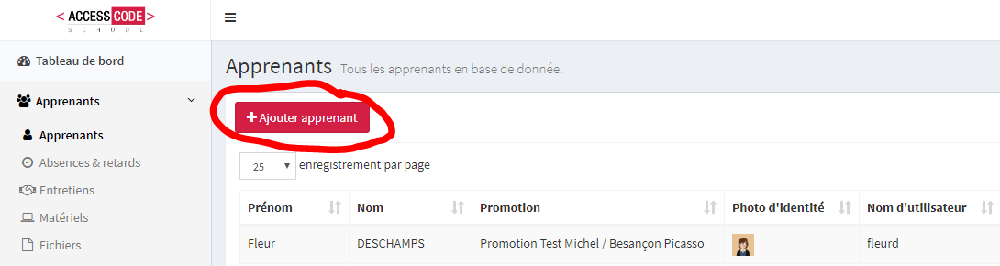
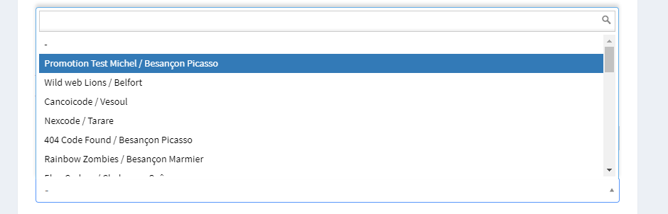
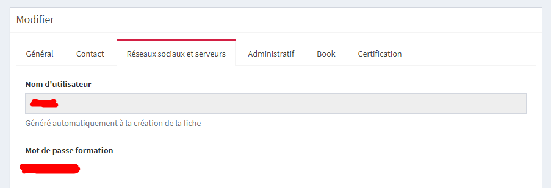

# Ajouter un utilisateur au chat

### La documentation suivante montre comment ajouter un utilisateur hors ACS dans le chat de l'ACS.

`0. Vous devez posséder un compte sur l'outil de suivi ACS` <suivi.accesscodeschool.fr>

`1. Rendez-vous dans le menu "Apprenants", puis cliquez sur "+ Ajouter apprenant"`

`2. Renseigner Prénom, Nom, puis assigner la promo "Promotion Test Michel / Besançon Picasso" (ou une autre promo de test)`

`3. Dans l'onglet "Contact", renseignez un email de formation et un email personnel.`

`4. Dans l'onglet "Réseaux sociaux et serveurs, cochez "Synchroniser avec le chat".`

`5. Enregistrez. Un message d'erreur peut apparaître, ne pas en tenir compte.`

`6. Dans l'onglet Réseaux sociaux et serveurs, un nom d'utilisateur aura apparau ainsi qu'un mot de passe. Ce sont les identifiants à utiliser pour se connecter au chat via l'URL` <chat.accesscodeschool.fr/home>

